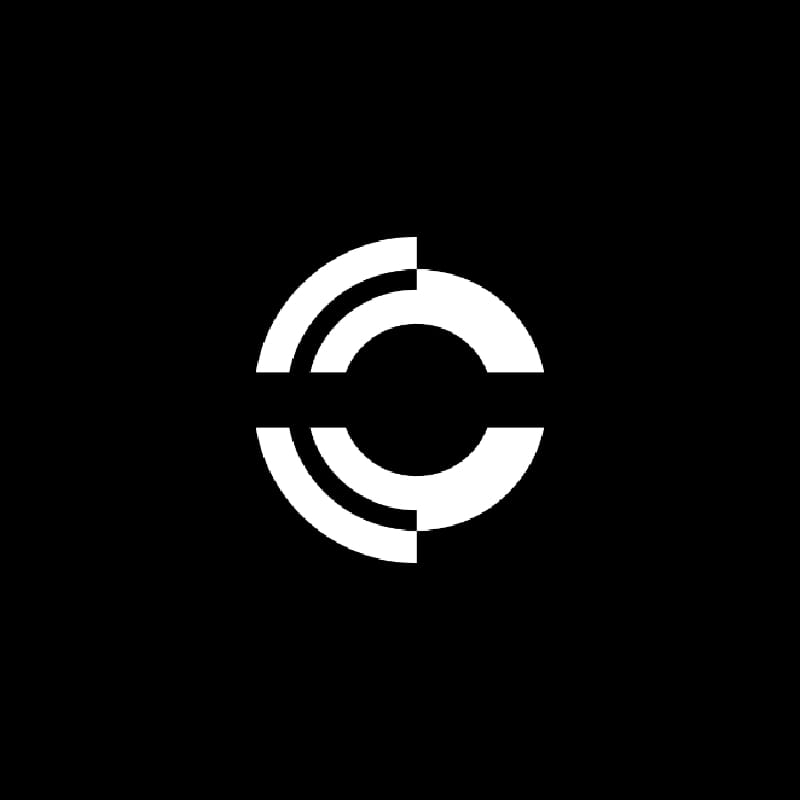

# SneppX-ALG

<p align="center">
  
</p>

> **Next-Generation AI Architecture** · Security built into the foundation.
> Not patched later. Not bolted on. **In every instruction.**

<p align="center">
  
  
  
  
  
  
  
  
  
</p>

---

## Table of Contents

- [What Is SneppX-ALG?](#-what-is-SneppX-ALG)
- [Architecture](#-architecture)
- [Security Architecture (S0–S9)](#-security-architecture-s0s9)
- [What Works Now (algo0.7)](#-what-works-now-algo07)
- [Quick Start](#-quick-start)
- [Project Stats](#-project-stats)
- [Roadmap](#️-roadmap)
- [Documentation](#-documentation)
- [Contributing](#-contributing)
- [License](#-license)
- [Governance](#-governance)
- [Links](#-links)
- [Citation](#-citation)

---

## What Is SneppX-ALG?

**SneppX-ALG** is a cognitive architecture for building secure artificial
general intelligence. It is a layered system of differentiable modules —
from computational substrate through neural program synthesis — with
security embedded at every level. Unlike conventional AI systems that
bolt on safety layers after the fact, SneppX-ALG weaves cryptographic
primitives, memory hardening, runtime monitoring, and formal verification
directly into its foundation.

- **A foundation, not a model** — the architecture into which learning,
  reasoning, memory, and planning are progressively integrated
- **A research platform, not a product** — built for audit and contribution
- **15-year roadmap** — from Seed (v0.1) through Gaia (v5.0)
- **Open source** — MIT license, developed in public

The current release is **algo0.8.2 (Sprout stage)**: a trainable system with
all six architectural modules wired into a unified differentiable pipeline,
a complete ten-phase security system (S0-S9), Python bindings for the full
tensor/model/trainer API, post-quantum crypto benchmarks (Kyber, Dilithium, SPHINCS+),
and **3,258 lines of hand-optimized x86-64 assembly** across 15 files covering
AES-NI, SHA-NI, ChaCha20 AVX2, Poly1305 SSE, Ed25519, Curve25519, Montgomery
multiplication, Barrett reduction, Keccak-f[1600] AVX2, constant-time operations,
secure memory wiping, and cache-constant table lookups.

---

## Architecture

```
┌──────────────────────────────────────────────────────────────────────────┐
│                     L6  Neural Program Engine (NPE)                       │
│              Differentiable program synthesis, 70+ opcodes, VM            │
├──────────────────────────────────────────────────────────────────────────┤
│             L5  Adaptive Resonance & Consolidation (ARC)                  │
│              Memory consolidation, prototype formation, replay            │
├──────────────────────────────────────────────────────────────────────────┤
│              L4  Symbolic Expression Reasoner (SER)                       │
│              Graph-based reasoning, hierarchical clustering               │
├──────────────────────────────────────────────────────────────────────────┤
│               L3  Hierarchical State Space (HSS)                          │
│              Multi-resolution SSM, linear-time parallel scan              │
├──────────────────────────────────────────────────────────────────────────┤
│                     L2  Attention (MHA)                                    │
│              Multi-head self-attention, RoPE, FlashAttention              │
├──────────────────────────────────────────────────────────────────────────┤
│              L1  Primitives & Security (S0–S9)                             │
│  Crypto · Memory · Obfuscation · Monitor · Network · AI · Key · Updates  │
│  Formal Verification · Penetration Testing                                │
├──────────────────────────────────────────────────────────────────────────┤
│                    L0  Computational Substrate                             │
│        Tensor Engine · Memory Allocator · Thread Pool · Profiler          │
└──────────────────────────────────────────────────────────────────────────┘
```

Each layer depends on all layers below it. Every component exposes a
differentiable training graph. The system can learn end-to-end on CPU.

---

## Security Architecture (S0–S9)

All ten security phases are **fully implemented** in algo0.7 — 21,809 lines
of real C code across 10 levels, compiled conditionally via per-level
preprocessor definitions (`SNEPPX_S0` through `SNEPPX_S9`) and tested by 30+
dedicated test files.

```
S0 ── S1 ── S2 ── S3 ── S4 ── S5 ── S6 ── S7 ── S8 ── S9
│     │     │     │     │     │     │     │     │     │
Crypto Memory Obfusc Monitor Network AI    UI    Update Formal Pentest
Core  Secure Engine  Engine  Sec   San    Sec   Sec    Verif  Report
      Mem
```

### S0 — Cryptographic Core
AES-256-GCM (AES-NI accelerated with constant-time key wipe), X25519 key exchange,
Ed25519 signatures (Montgomery ladder, point ops, field arithmetic), ChaCha20-Poly1305
(AVX2 accelerated), SHA-256 (SHA-NI accelerated, HMAC), SHA-3 (224/256/384/512),
BLAKE3, Argon2id, HKDF, HMAC, PBKDF2, Hash_DRBG, BigNum arithmetic
(add/sub/mul/div/mod/exp/GCD/inv_mod/Miller-Rabin), Montgomery multiplication,
Barrett reduction, GF(256) arithmetic, Keccak-f[1600] (AVX2), Entropy Pool,
SipHash, random from OS entropy source, constant-time operations (select/compare/
swap/negate), cache-constant table lookups (S-box/T-table), secure memory wiping
(3-pass register/page/XMM). All x86-64 assembly is **constant-time, speculation-safe
(lfence), and cache-timing resistant**.

### S1 — Secure Memory
Guard pages with PROT_NONE boundaries, 128-bit stack canaries with generation
counters, ASLR via VirtualAlloc/mmap, mlock/VirtualLock, memory quarantine
with configurable scrub patterns (0x00, 0xFF, random), W^X via mprotect,
seccomp-bpf filters on Linux, PAC pointers on arm64, Control Flow Guard on
Windows, shadow call stack with depth enforcement, freelist integrity canaries,
heap coalescing, over-allocation guard pages, allocation statistics tracking.

### S2 — Obfuscation Engine
Control flow flattening (LIGHT–MAXIMUM), string encryption with XOR/AES,
instruction substitution with equivalent sequences, opaque predicates using
arithmetic/pointer/context invariants, VM obfuscation with encrypted dispatch
and multi-VM support, binary opcode substitution, junk code insertion, anti-debug
via ptrace/TLS/SEH, white-box AES implementation, IAT obfuscation, anti-dump.

### S3 — Runtime Monitor
Code tamper detection via CRC, function pointer hook detection via redirection
analysis, heap corruption sentinel via canary verification, ML-based anomaly
detection using statistical profiling, file system integrity monitoring,
persistence mechanism detection, process injection detection, TOCTOU race
detection, guard page stack overflow detection, network connection monitoring,
USB/device detection, kernel object monitoring, event ring buffer,
self-integrity checks, heartbeat monitoring, callback chaining, alert
correlation engine.

### S4 — Network Security
TLS 1.3 client and server with full handshake, Noise protocol framework
(NK/XX/IK patterns), QUIC with stream multiplexing, mTLS certificate chain
validation, OCSP with response caching, Certificate Transparency log verifier,
DNS-over-HTTPS resolver, WireGuard protocol implementation, IP blocklist,
Network Intrusion Detection System (NIDS), rate limiter with token bucket,
port knocking daemon, gRPC authentication interceptor.

### S5 — AI Sanitization
Semantic prompt injection detection, multi-language jailbreak detection
(12 languages), encoded attack decoder (base64/hex/unicode/other encodings),
token-level anomaly scoring via statistical language models, model inversion
defense through gradient perturbation, data extraction prevention via output
sanitization, training data sanitization pipeline, model watermarking with
robust embedding, adversarial smoothing for input robustness, bias measurement
across demographic axes, factuality scoring, prompt policy engine with
constraint enforcement.

### S6 — Key Management & Security UI
HSM-backed key store with wrap/unwrap operations, Shamir Secret Sharing over
GF(256) with configurable threshold, key ceremony workflow with quorum approval,
automatic key rotation, web-based security dashboard with real-time status,
threat visualization with interactive graphs, policy DSL compiler, compliance
report generator with HTML export (NIST 800-53, SOC2, GDPR), tamper-evident
audit chain with CRC linking across entries.

### S7 — Secure Updates
TUF-compliant multi-role key infrastructure (root/targets/snapshot/timestamp),
bsdiff delta generation and application, A/B partition management with atomic
swap and rollback, manifest verification, TPM PCR read/quote/seal/unseal for
platform attestation, canary rollout with graduated promotion percentages,
offline bundle creation and signature verification, dependency resolver with
cycle detection.

### S8 — Formal Verification
TLA+ specification parser producing internal AST, LTL model checker supporting
G/F/X operators with explicit-state exploration, symbolic execution engine with
path constraint solving, loop invariant inference using interval and octagonal
abstract domains, data flow taint analysis for security properties, Lean 4
theorem proof export, state machine model checking with reachability and cycle
detection, DOT graph export for visualization.

### S9 — Penetration Testing
Automated CVE vulnerability scanner querying local CVE dataset, fuzz testing
harness with coverage-guided input mutation, API security scanner testing for
OWASP Top Ten vulnerabilities, dependency vulnerability checker, static analysis
for CWE patterns, supply chain audit with SLSA provenance attestation, crypto
protocol testing against known attacks, red team simulation with configurable
adversary profiles, compliance auto-checker (NIST 800-53, SOC2, GDPR), bug
bounty triage workflow, security regression suite, self-audit framework.

### S10–S15 — AGI Safety (Planned)
S10 interpretability, S11 value learning, S12 corrigibility, S13 containment,
S14 cooperative AI, S15 recursive oversight — planned for versions 2.0–4.0.

---

## What Works Now (algo0.7.8)

| Component | Status | What Works |
|-----------|--------|------------|
| Tensor Core | ✅ Complete | Multi-dim arrays, 8+ dtypes, row-major, 80+ ops, CUDA optional |
| Memory Allocator | ✅ Complete | Secure alloc, quarantine, guard pages, freelist integrity |
| Thread Pool | ✅ Complete | Work-stealing, futures, parallel_for/parallel_reduce |
| Autodiff | ✅ Complete | 40+ backward passes, tape, gradient clipping, detach |
| Optimizers | ✅ Complete | SGD, Adam, AdamW, RMSprop + LR schedulers |
| Training Loop | ✅ Complete | Train step, evaluate, checkpoint save/load |
| Attention (MHA) | ✅ Complete | Multi-head, RoPE, causal mask, KV-cache |
| HSS | ✅ Complete | Forward pass, parallel scan, training graph |
| SER | ✅ Complete | Top-k routing, learned gating, load balancing |
| ARC | ✅ Complete | Input guard, gradient obfuscation, output verifier |
| NPE | ✅ Complete | 70+ opcodes, VM, type checker, training graph |
| FM | ✅ Complete | Memory banks, sync protocols, gradient compression |
| Data Pipeline | ✅ Complete | TextDataset, BPE tokenizer, batching |
| Inference Engine | ✅ Complete | Autoregressive gen, top-k/p sampling, temperature |
| Python API | ✅ Complete | pybind11 bindings, 107 public symbols, full tensor/model/trainer/crypto API |
| PQ Benchmarks | ✅ Complete | Kyber-768 (0.29ms keygen), Dilithium-3 (1.50ms keygen), SPHINCS+-128s |
| S0 Crypto | ✅ Complete | AES-GCM, X25519, Ed25519, ChaCha20-Poly1305, SHA-3, BLAKE3, Argon2id, BigNum, DRBG |
| S1 Memory | ✅ Complete | Guard pages, canaries, ASLR, W^X, seccomp, PAC, CFG, shadow stack |
| S2 Obfuscation | ✅ Complete | CF flattening, string encryption, VM obfuscation, white-box AES, anti-debug |
| S3 Monitor | ✅ Complete | Code tamper, heap sentinel, ML anomaly, process injection, FS integrity |
| S4 Network | ✅ Complete | TLS 1.3, Noise, QUIC, WireGuard, NIDS, mTLS |
| S5 AI Sanitizer | ✅ Complete | Injection detection, jailbreak, watermarking, bias, policy |
| S6 Key Mgmt | ✅ Complete | HSM, Shamir, key ceremony, dashboard, compliance |
| S7 Updates | ✅ Complete | TUF, bsdiff, A/B partitions, TPM attestation |
| S8 Formal Verif | ✅ Complete | TLA+ parser, LTL checker, symex, Lean 4 export |
| S9 Pentest | ✅ Complete | Vuln scanner, fuzz harness, red team, compliance check |

---

## Quick Start

### Build from Source

**Prerequisites:**
- CMake 3.16+
- C11 compiler (MSVC 2022, GCC 12+, Clang 16+)
- C++20 compiler (for obfuscation engine, optional)
- Python 3.11+ (for bindings, optional)
- CUDA Toolkit 12.0+ (for GPU acceleration, optional)

```bash
git clone https://github.com/ammar49-cyber/SNEPPX_ALG.git
cd SNEPPX_ALG
mkdir build && cd build
cmake .. -DCMAKE_BUILD_TYPE=Release -DSNEPPX_BUILD_TESTS=ON
cmake --build .
ctest --output-on-failure

# Build with Python bindings
cmake -B build_py -DSNEPPX_BUILD_PYTHON=ON -Dpybind11_DIR=</path/to/pybind11>
cmake --build build_py --target _SNEPPX_c --config Release

# Build and run PQ crypto benchmarks
cmake -B build_bench -DSNEPPX_BUILD_BENCHMARKS=ON -DSNEPPX_BUILD_TESTS=OFF
cmake --build build_bench --target bench_pq_crypto --config Release
./build_bench/tests/benchmark/Release/bench_pq_crypto
```

### C Example

```c
#include "multidimensional_tensor_engine.h"
#include "multi_head_attention_module.h"
#include "autodiff.h"
#include "training_loop.h"

int main() {
    // Create a tensor
    size_t shape[] = {2, 4, 16};
    SNEPPXTensor* input = SNEPPX_tensor_randn(shape, 3, SNEPPX_FLOAT32);

    // Multi-head attention forward
    SNEPPXAttentionConfig cfg = SNEPPX_attn_config_default();
    cfg.d_model = 16; cfg.num_heads = 4; cfg.head_dim = 4;
    SNEPPXAttentionWeights* attn = SNEPPX_attn_weights_create(cfg, 42);
    SNEPPXTensor* cos_t = SNEPPX_rope_precompute(4, 4, 10000.0f);
    SNEPPXTensor* output = SNEPPX_attn_forward(attn, input, cos_t, cos_t);

    printf("Output shape: ");
    for (int i = 0; i < SNEPPX_tensor_ndim(output); i++)
        printf("%zu ", SNEPPX_tensor_shape(output)[i]);
    printf("\n");

    SNEPPX_tensor_destroy(input);
    SNEPPX_tensor_destroy(cos_t);
    SNEPPX_tensor_destroy(output);
    SNEPPX_attn_weights_destroy(attn);
    return 0;
}
```

### Python Example

```python
import numpy as np
from SneppX_ALG import _SNEPPX_c as ax

# Create tensors
t = ax._Tensor.randn(np.array([4, 8, 16]), ax.FLOAT32)

# Arithmetic
t2 = t.add(t)

# Create a model
m = ax.model_create(ax.SNEPPXArchConfig())

# Crypto
h = ax.crypto.sha3_256(b"hello world")
sig = ax.crypto.ed25519_sign(sk, b"message")
```

---

## Project Stats

| Metric | Value |
|--------|-------|
| Total Source | **~69,000 lines** |
| Assembly (x86-64) | **3,258 lines across 15 files** |
| C Source | ~45,200 lines |
| Headers | ~5,900 lines |
| C++ Source | ~4,900 lines |
| Python | ~1,700 lines |
| Source Files | **~455** |
| Security Implementation | **25,067+ lines** (S0-S9 + assembly) |
| Security Levels | **10 of 10** implemented |
| Registered Tests | **180+** |
| PQ Benchmarks | Kyber-768, Dilithium-3, SPHINCS+-128s |
| Build Time | ~35s (Release, 8 cores) |
| Dependencies | **0** for C core |
| Platforms | Windows (MSVC), Linux (GCC/Clang), macOS (Clang) |
| Python | 3.11+ (optional, via pybind11) |
| Project Size on Disk | **737.85 MB** |
| Architecture Layers | **7** (all differentiable, wired end-to-end) |

---

## Roadmap

| Stage | Version | Params | Context | Capability | Timeframe |
|-------|---------|--------|---------|------------|-----------|
| Seed | v0.1 | 0 | 1K | Structural proof of architecture | 2026 — released |
| **Sprout** | **algo0.8.2** | **1–10M** | **8K** | **Trainable on CPU, S0-S9 complete, 3,258 lines x86-64 asm, Python bindings, PQ benchmarks** | **2026 — current** |
| Sapling | v1.0 | 7B | 128K | Competitive language modeling | 2027 H2 |
| Young Tree | v2.0 | 70B | 1M | Proto-AGI with reasoning and planning | 2029 |
| Mature Tree | v2.5 | 140B | 2M | Multimodal AGI | 2030 |
| Forest | v3.0 | 1T | 10M | Collective AGI | 2032 |
| Ecosystem | v4.0 | 10T | Infinite | Autonomous research | 2035 |
| Gaia | v5.0 | >10T | Infinite | Superintelligence | 2041 |

---

## Documentation

| Document | Description |
|----------|-------------|
| [docs/index.md](docs/index.md) | Documentation landing page |
| [docs/ARCHITECTURE.md](docs/ARCHITECTURE.md) | Full architecture with math |
| [docs/security.md](docs/security.md) | Security architecture deep dive |
| [docs/ROADMAP.md](docs/ROADMAP.md) | Detailed project roadmap |
| [docs/api/c.md](docs/api/c.md) | C API reference |
| [docs/api/python.md](docs/api/python.md) | Python API reference |
| [docs/installation.md](docs/installation.md) | Platform-specific build guides |

Full documentation is available at [SNEPPXsite.vercel.app](https://SNEPPXsite.vercel.app).

---

## Contributing

We accept email patches. No pull requests. Technical merit above all.

```bash
git format-patch -1 HEAD
git send-email --to=algoSNEPPX@gmail.com 0001-your-patch.patch
```

See [CONTRIBUTING.md](CONTRIBUTING.md) for coding style, GPG/Ed25519 signing,
and testing requirements.

## License

- **Algorithm (C/C++ core, Python bindings)**: [MIT License](LICENSE)
- **Website and distribution**: Closed-source

## Governance

**BDFL**: Ammar [SNEPPX]

| Purpose | Contact |
|---------|---------|
| Patches | algoSNEPPX@gmail.com |
| Security | algoSNEPPX@gmail.com |
| Conduct | algoSNEPPX@gmail.com |

---

## Links

<p align="center">
  <a href="https://SNEPPXsite.vercel.app"><b>Website</b></a> ·
  <a href="https://github.com/ammar49-cyber/SNEPPX_ALG"><b>GitHub</b></a> ·
  <a href="https://x.com/SNEPPXdrv"><b>Twitter / X</b></a> ·
  <a href="https://www.instagram.com/algoSNEPPX/"><b>Instagram</b></a> ·
  <a href="https://www.youtube.com/@SNEPPX_ALG"><b>YouTube</b></a>
</p>

---

## Citation

```bibtex
@software{SneppX_ALG_2026,
  author = {Ammar [SNEPPX]},
  title = {{SneppX-ALG}: Cognitive Architecture for Secure Artificial General Intelligence},
  url = {https://github.com/ammar49-cyber/SNEPPX_ALG},
  year = {2026}
}
```

---

<p align="center">
  <b>SneppX-ALG</b> — <i>Security in every instruction.</i>
</p>

<p align="center">
  <a href="#SneppX-ALG">Back to Top</a>
</p>
