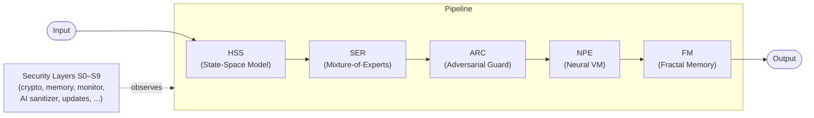
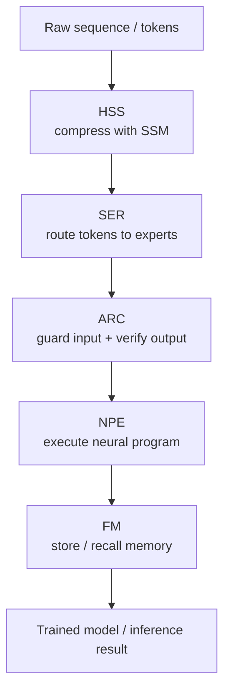

# SNEPPX-Alg 🤖 — The Universal Open-Source AI Algorithm Framework

<p align="center">
<b>A universal, open-source AI algorithm framework in C/C++ &amp; CUDA</b> — tensor engine, autograd, MoE/SSM transformers, LLM model zoo, quantization, distributed-training primitives &amp; 10-layer AI security.
</p>

<p align="center">
<a href="https://github.com/ammar49-cyber/sneppx-alg/stargazers"></a>
<a href="https://github.com/ammar49-cyber/sneppx-alg/network/members"></a>
<a href="https://github.com/ammar49-cyber/sneppx-alg/issues"></a>
<a href="https://github.com/ammar49-cyber/sneppx-alg/blob/main/LICENSE"></a>
</p>

[]() []() []() []() [](https://github.com/ammar49-cyber/sneppx-alg/pulls) [](https://github.com/ammar49-cyber/sneppx-alg/discussions) [](https://github.com/ammar49-cyber/sneppx-alg)

> **ARIX_Algo** — A secure, composable, production-grade AI algorithm pipeline with 10 security layers (S0–S9), model zoo, distributed-training primitives, quantization, and advanced architectures.

**⭐ Star this repo** to support the project and help us reach 1,000 stars!

## 📑 Table of Contents
- [Overview](#overview)
- [Architecture](#architecture)
- [Component Status](#component-status)
- [The 5-Stage Pipeline](#the-5-stage-pipeline)
- [Security Layers (S0–S9)](#security-layers-s0s9)
- [Model Zoo](#model-zoo)
- [C HTTP REST API](#c-http-rest-api)
- [Python Bindings](#python-bindings)
- [Build & Quickstart](#build--quickstart)
- [Documentation](#documentation)
- [Contributing](#contributing)
- [Star History](#-star-history)
- [License](#license)

## Overview

SNEPPX-Alg (codename **ARIX_Algo**) is a universal, MIT-licensed AI algorithm framework written primarily in **C11 / C++20 with CUDA**. It organizes model construction and inference as a composable, secure **5-stage pipeline** and wraps it with a layered security model (S0–S9). The codebase is large (~183K LOC) and spans a core tensor/autograd substrate, algorithm implementations, accelerator drivers, a security stack, an HTTP serving layer, and Python bindings.

Design goals:
- **Auditable native core** — the hot path lives in C/CUDA you can read and verify.
- **Composable pipeline** — HSS → SER → ARC → NPE → FM stages are independently testable.
- **Security by design** — ten layers from crypto to pentest are built into the framework.
- **Open & extensible** — opt-in backends, a model zoo, and a Python API on top of the native core.

## Architecture

The framework is structured as a secure pipeline. Each stage consumes the previous stage's output and the whole flow is observed by the security layers.


```mermaid
flowchart LR
    IN([Input]) --> HSS
    subgraph Pipeline
        HSS["HSS<br/>(State-Space Model)"]
        SER["SER<br/>(Mixture-of-Experts)"]
        ARC["ARC<br/>(Adversarial Guard)"]
        NPE["NPE<br/>(Neural VM)"]
        FM["FM<br/>(Fractal Memory)"]
    end
    HSS --> SER --> ARC --> NPE --> FM
    FM --> OUT([Output])
    SEC["Security Layers S0–S9<br/>(crypto, memory, monitor,<br/>AI sanitizer, updates, ...)"]
    SEC -.observes.-> Pipeline
```

### Directory layout

| Path | Purpose |
|------|---------|
| `kernel/` | Core tensor / autograd / optimizer / trainer / attention substrate, `distributed/`, `quantization/` |
| `algorithms/` | HSS, SER, ARC, NPE, FM, Transformer, ViT, GCN, RNN, GAN, Diffusion, RL, `model_zoo/` |
| `drivers/` | Accelerator backends (CUDA, ROCm, Vulkan, TPU, HTTP, ZK, Metal*, oneAPI*) |
| `security/` | S0–S9 security layers (crypto, memory, monitor, network, AI, vault, updates, formal, obfuscation, pentest) |
| `net/` | HTTP serving, distributed (NCCL), gRPC, QUIC, RDMA, WebSocket |
| `bindings/python/` | `SneppX_ALG` Python package + pybind wrappers |
| `docs/` | ~70 reference docs (see [Documentation](#documentation)) |
| `tests/` `examples/` `scripts/` `tools/` | Test suite, demos, dev tooling |

`*` Metal and oneAPI are reference-compute backends enabled via `SNEPPX_BUILD_METAL` / `SNEPPX_BUILD_ONEAPI`. Vulkan/TPU/HTTP/ZK do real reference computation and are enabled via `SNEPPX_BUILD_VULKAN` / `SNEPPX_BUILD_TPU` / `SNEPPX_BUILD_HTTP` / `SNEPPX_BUILD_ZK`.

## Component Status

We label maturity honestly so contributors know where to focus. Status: 🟢 Stable · 🟡 Experimental · 🔴 Known gap / under remediation.

| Component | Status | Notes |
|-----------|--------|-------|
| HSS (SSM) | 🟢 Stable | Selective-scan recurrence, layer norm, discretize implemented (`algorithms/hss/core`) |
| SER (MoE) | 🟢 Stable | Gating, expert routing, capacity balance (`algorithms/ser/core`) |
| ARC (Adversarial Guard) | 🟢 Stable | Input guard + output verifier + security metrics (`algorithms/arc/core`) |
| NPE (Neural VM) | 🟢 Stable | 16-register / 32-opcode dispatch with tensor kernels (`algorithms/npe/core/vm.c`) |
| FM (Fractal Memory) | 🟢 Stable | Memory-bank read/write + EWM combine (`algorithms/fm/core`) |
| CUDA kernels | 🟡 Experimental | Real `.cu` files; compiled only with `-DSNEPPX_BUILD_CUDA=ON` (OFF by default) |
| Crypto core (S0, classical) | 🟢 Stable | Ed25519, X25519, ChaCha20-Poly1305, SHA-3, AES-GCM, Argon2id, HMAC-DRBG |
| PQC (Kyber/Dilithium/SPHINCS+) | 🟡 Experimental | Implemented but **not yet FIPS-KAT validated** |
| Signed updates (S7) | 🔴 Known gap | Current verifier is forgeable (`hash ^ 0xAA`); Ed25519 signing planned |
| Formal verification (S8) | 🔴 Known gap | LTL model checker is currently a no-op; bounded checking planned |
| Memory / Obfuscation / Monitor / Vault / Pentest | 🟢 Stable | Substantial implementations in `security/` |
| Model Zoo `from_pretrained()` | 🟡 Experimental | Resolves architecture configs + builds skeleton; weight download unwired |
| C HTTP REST API | 🟡 Experimental | `/v1/health`, `/v1/models` real; `/v1/generate` is a demo scaffold |
| Distributed training | 🟡 Experimental | DDP/ZeRO/TP/PP/EP scaffolded; collectives run as single-device reference paths, NCCL wiring in progress |
| Python bindings | 🟢 Stable | NumPy-backed `Tensor`/`nn`/`Trainer`; C `_Tensor` reachable via pybind |

## The 5-Stage Pipeline


```mermaid
flowchart TD
    A[Raw sequence / tokens] --> B[HSS<br/>compress with SSM]
    B --> C[SER<br/>route tokens to experts]
    C --> D[ARC<br/>guard input + verify output]
    D --> E[NPE<br/>execute neural program]
    E --> F[FM<br/>store / recall memory]
    F --> G[Trained model / inference result]
```

- **HSS — Hierarchical State-Space model** (`algorithms/hss/`): SSM front-end for long-range sequence modeling. Entry points `SNEPPX_hss_model_create`, `SNEPPX_hss_forward`.
- **SER — Sparse Expert Router** (`algorithms/ser/`): Mixture-of-Experts with gating, capacity balancing, and expert forwarding. Entry points `SNEPPX_ser_model_create`, `SNEPPX_ser_forward`, `SNEPPX_ser_gate_forward`.
- **ARC — Adversarial Robustness guard** (`algorithms/arc/`): input guard, output verifier, and gradient obfuscation that report security metrics. Entry point `SNEPPX_arc_forward`.
- **NPE — Neural Processing Engine** (`algorithms/npe/`): a 16-register, 32-opcode neural VM (`SNEPPX_npe_vm_run`, `SNEPPX_npe_vm_step`) executing tensor operations as programs.
- **FM — Fractal Memory** (`algorithms/fm/`): layered memory banks with a controller and EWM combine (`SNEPPX_fm_forward`).

## Security Layers (S0–S9)

Ten layers wrap the pipeline:

| ID | Layer | Status |
|----|-------|--------|
| S0 | Cryptography core (classical + PQC) | Classical 🟢 / PQC 🟡 |
| S1 | Secure memory hardening | 🟢 |
| S2 | Code obfuscation | 🟢 |
| S3 | Behavioral monitoring | 🟢 |
| S4 | Network security | 🟡 |
| S5 | AI sanitizer (prompt filter, DP) | 🟡 |
| S6 | Key vault & audit logging | 🟢 |
| S7 | Signed updates | 🔴 (forgeable, under remediation) |
| S8 | Formal verification | 🔴 (no-op, under remediation) |
| S9 | Penetration testing / self-audit | 🟢 |

> Honest note: several layers are substantial, but the project openly tracks gaps — **S7 signed-update verification and S8 formal verification are flagged for remediation**, and the post-quantum primitives are not yet FIPS-KAT validated. See `docs/security_layers.md` for the full mapping.

## Model Zoo

The model zoo provides architecture presets and a `from_pretrained()` entry point.

- **Supported families (config presets):** LLaMA 2 / 3, Mistral, Qwen 2, DeepSeek V2 — resolved via `SNEPPX_llm_config_from_name` (`algorithms/model_zoo/`).
- **`from_pretrained()`** (`bindings/python/.../model_zoo.py`): maps a model id → (family, size), builds the architecture skeleton, and returns a config. End-to-end pretrained-weight download/conversion is **in progress**; the safetensors / PyTorch `.bin` parsers in `hf_integration.py` are real but not yet wired into the loader.

```python
# Illustrative — resolves config + builds skeleton (weights download in progress)
from SneppX_ALG.interface_bindings.model_zoo import from_pretrained
model = from_pretrained("meta-llama/Llama-3-8b")
```

## C HTTP REST API

A real cross-platform socket server (`net/http/http_server.c`) with a route table. **Opt-in** via `-DSNEPPX_BUILD_HTTP=ON` (OFF by default).

| Endpoint | Status | Description |
|----------|--------|-------------|
| `GET /v1/health` | 🟢 | Liveness check |
| `GET /v1/models` | 🟢 | List preset model configs |
| `GET /v1/models/{id}` | 🟢 | Fetch one model config |
| `POST /v1/generate` | 🟡 | **Demo scaffold** — deterministic token generator, no model forward pass yet |

Run the demo:

```powershell
cmake -B build -DSNEPPX_BUILD_HTTP=ON
cmake --build build --config Release
# see examples/http_server_demo.c
```

## Python Bindings

The `SneppX_ALG` package exposes a NumPy-backed `Tensor`, `nn` modules, and trainers (`Trainer`, `UltraTrainer`, LoRA/DPO/GRPO). The C `_Tensor` engine is wrapped via pybind (`_SNEPPX_c.Tensor`) and used internally by the C algorithm cores.

```python
# Illustrative — NumPy-backed tensor math
import numpy as np
from SneppX_ALG import Tensor

x = Tensor(np.random.randn(4, 8))
w = Tensor(np.random.randn(8, 16))
y = x @ w
print(y.shape)
```

## Build & Quickstart

```powershell
cmake -B build -DCMAKE_BUILD_TYPE=Release
cmake --build build --config Release
cd build && ctest -C Release --output-on-failure
```

Opt-in backends — real reference implementations, **OFF by default**. Each performs genuine computation via the shared reference-compute path and reports `DRIVER_UNSUPPORTED` when its flag is off:

```powershell
cmake -B build -DSNEPPX_BUILD_VULKAN=ON   # Vulkan — real GEMM / elementwise reference compute
cmake -B build -DSNEPPX_BUILD_TPU=ON      # TPU — real GEMM reference + device emulation
cmake -B build -DSNEPPX_BUILD_HTTP=ON     # HTTP — real BSD-socket transport (GET/POST)
cmake -B build -DSNEPPX_BUILD_ZK=ON      # ZK — real Schnorr proof over Curve25519 (p = 2^255 - 19)
cmake -B build -DSNEPPX_BUILD_METAL=ON   # Apple Metal reference backend
cmake -B build -DSNEPPX_BUILD_ONEAPI=ON  # Intel oneAPI/SYCL reference backend
```

Build everything (all opt-in backends + tests) and run the full suite:

```powershell
cmake -B build -DCMAKE_BUILD_TYPE=Release -DSNEPPX_BUILD_TESTS=ON `
  -DSNEPPX_BUILD_VULKAN=ON -DSNEPPX_BUILD_TPU=ON -DSNEPPX_BUILD_HTTP=ON -DSNEPPX_BUILD_ZK=ON
cmake --build build --config Release
cd build && ctest -C Release --output-on-failure
```

## Documentation

| Area | Where to start |
|------|----------------|
| Quick start & build | [`docs/index.md`](docs/index.md) · [`QUICKSTART.md`](QUICKSTART.md) |
| Contribution framework | [`docs/CONTRIBUTOR_TIERS.md`](docs/CONTRIBUTOR_TIERS.md) |
| Branching strategy | [`docs/BRANCHING_STRATEGY.md`](docs/BRANCHING_STRATEGY.md) |
| Code review guide | [`docs/CODE_REVIEW_GUIDE.md`](docs/CODE_REVIEW_GUIDE.md) |
| API reference | [`docs/API.md`](docs/API.md) · [`docs/api/python.md`](docs/api/python.md) |
| Architecture | [`docs/ARCHITECTURE.md`](docs/ARCHITECTURE.md) |
| Security layers | [`docs/security_layers.md`](docs/security_layers.md) |
| Development workflow | [`docs/DEVELOPMENT.md`](docs/DEVELOPMENT.md) |
| All docs | [`docs/README.md`](docs/README.md) |

## Contributing

We run a five-tier contribution framework and label good entry points:

- 🏷️ `good first issue` · `help wanted` · `documentation` — see the [open issues](https://github.com/ammar49-cyber/sneppx-alg/issues)
- 💬 [Discussions](https://github.com/ammar49-cyber/sneppx-alg/discussions) — announcements, Q&A, ideas, show-and-tell
- 📚 Learning paths & tier system in [`docs/CONTRIBUTOR_TIERS.md`](docs/CONTRIBUTOR_TIERS.md)

PRs are welcome.

## ⭐ Star History

[](https://www.star-history.com/#ammar49-cyber/sneppx-alg&Date)

## License

MIT — see [`LICENSE`](./LICENSE). Maintained by **Ammar [SNEPPX]**.
